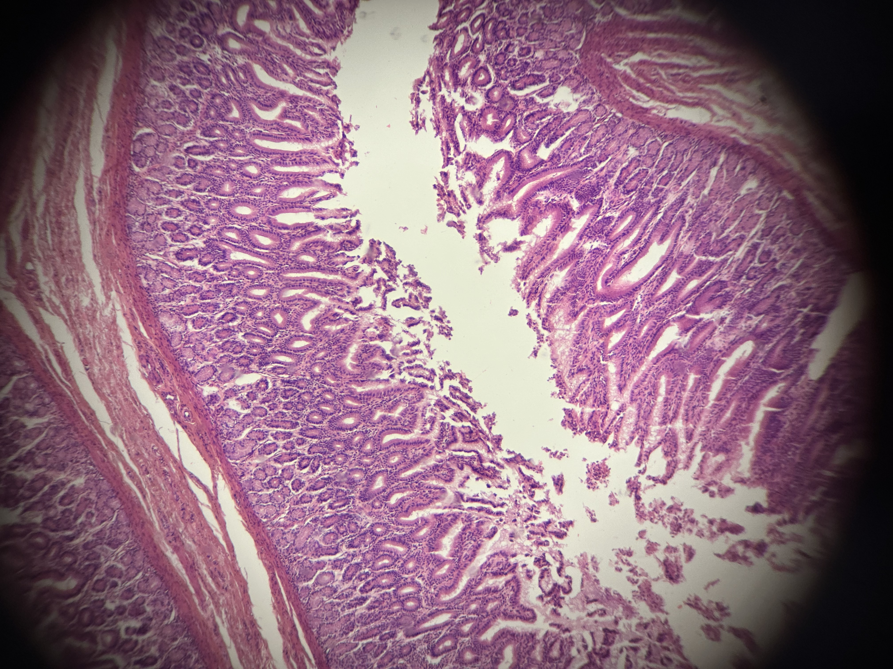
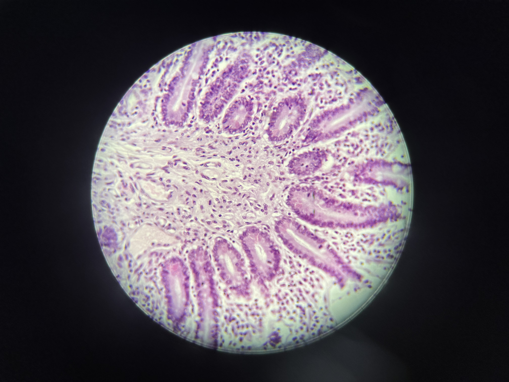
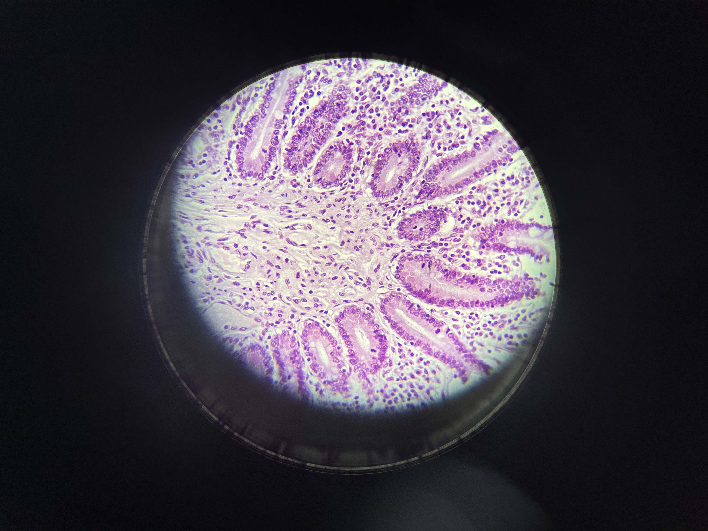

# Atlas de Histología Digital

## Overview

This digital histology atlas is an invaluable educational resource designed specifically for medical students, healthcare professionals, and anyone studying human tissue structures. It features a comprehensive collection of 28 high-quality microscopic images covering all major tissue types and organ systems.

## Educational Value

- **High-Quality Microscopic Images**: Crystal-clear histological slides that showcase detailed tissue structures
- **Interactive Features**: Zoom capabilities for detailed examination of cellular structures
- **Comprehensive Descriptions**: Each slide includes detailed descriptions in Spanish, explaining key features and characteristics
- **Systematic Organization**: Organized progression from basic tissue types to complex organ systems

## Featured Tissue Types

The atlas covers essential tissue categories including:

- Epithelial tissues (simple and stratified)
- Connective tissues (loose and dense)
- Muscle tissues (smooth, skeletal, and cardiac)
- Nervous tissue
- Major organ systems (cardiovascular, respiratory, digestive, etc.)

## Sample Images

Here are some examples of the high-quality histological slides available in this atlas:

### Epithelial Tissue

_Simple squamous epithelium - Essential for understanding gas exchange surfaces_

### Muscle Tissue

_Skeletal muscle - Showing characteristic striations and multinucleation_

### Nervous Tissue

_Neural tissue - Demonstrating neurons and supporting cells_

## Technical Features

- Built with React for smooth user interaction
- Responsive design for various screen sizes
- Dark/light mode toggle for comfortable viewing
- Advanced zoom functionality for detailed examination
- Thumbnail navigation for easy slide browsing

## Getting Started

1. Clone the repository
2. Install dependencies: `npm install`
3. Start the development server: `npm run dev`
4. Open your browser and navigate to the local server address

## Author

Created by Luis Hazael Flores Ramírez

## License

This project is licensed under the MIT License - see the LICENSE file for details.
